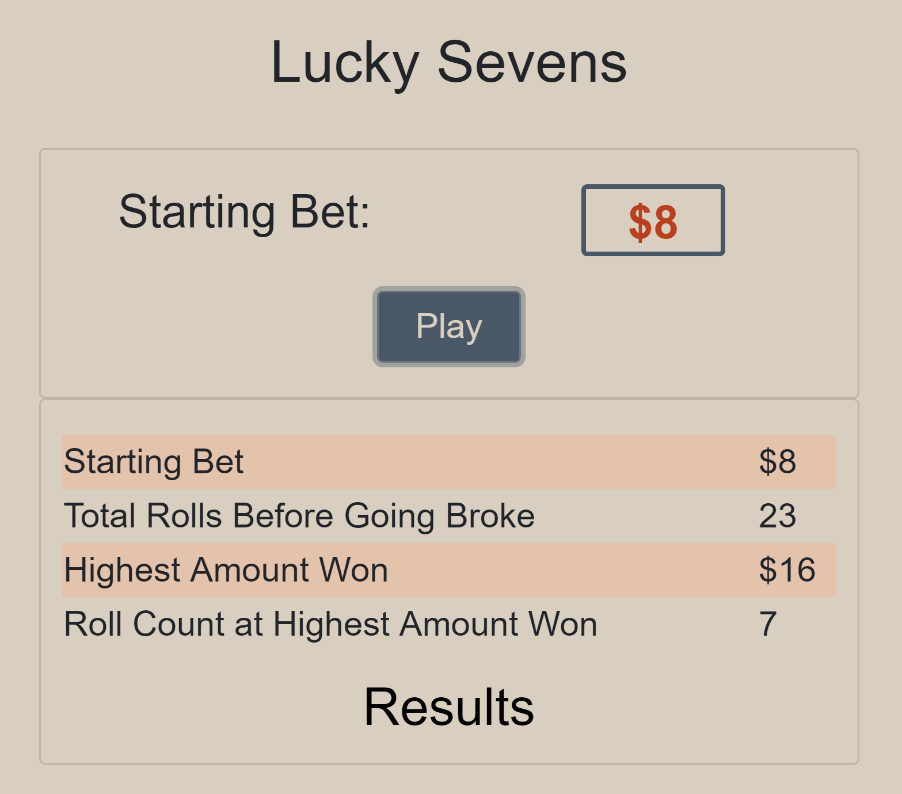

# Lucky-Sevens

This program plays the following game

1. The program asks the user how many dollars they have to bet. The user selects the number>0.

2. When the user clicks the Play button, the program rolls the dice repeatedly until all the money is gone.

3. Each round, the program rolls a virtual pair of dice for the user.
If the sum of the 2 dice is equal to 7, the player wins $4 otherwise, the player loses $1.

4. The program ends when the user loses all the money, then the Results table is displayed.

You can find the game on
[Github](https://edudek002.github.io/Lucky-Sevens/)

